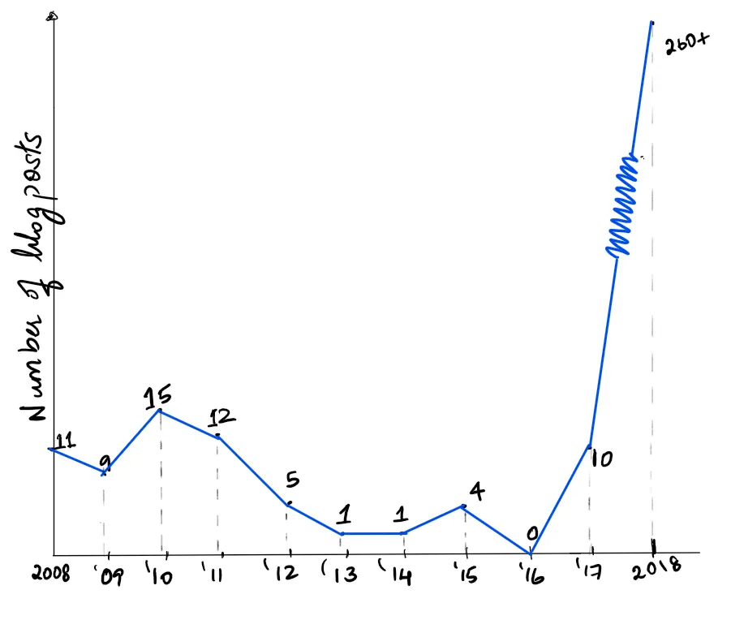
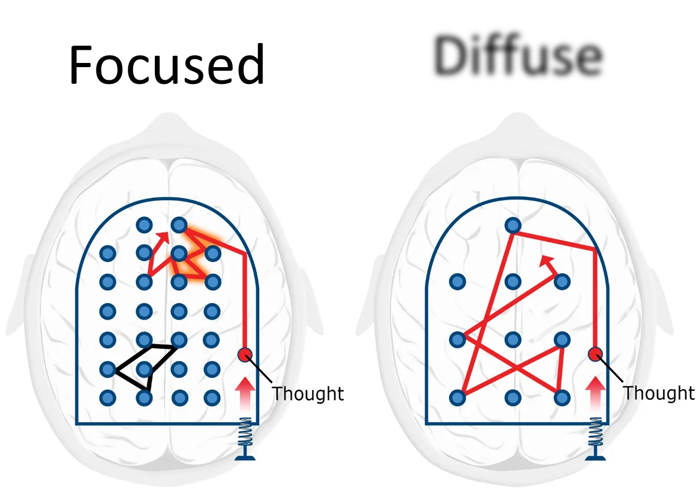
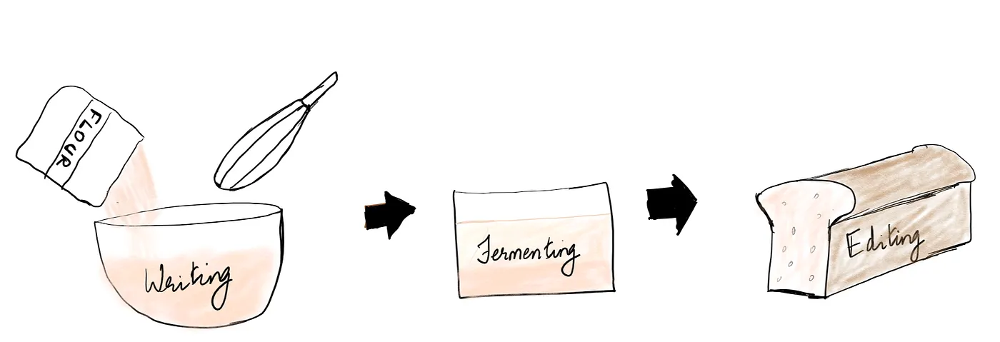

Do you feel that you do not write enough?

[Peter Thiel's popular interview question](https://fs.blog/2015/11/the-single-best-interview-question-you-can-ask/) for hiring new entrepreneurs is "What important truth do very few people agree with you on?" I'll take a shot at answering it shortly.

The act of writing has limitless potential. Adam Grant [talks](https://www.linkedin.com/pulse/20130528121344-69244073-the-power-of-the-pen-can-writing-make-us-happier-healthier-and-more-productive/) about how writing 15 minutes a day contributes to a 50% decrease in mental illness caused due to trauma. In another study, a group of engineers who had lost their jobs were taught to write everyday for 20 minutes. 52% of these engineers found new jobs in an eight month period. In comparison, the success rate in the control group was merely 19%. Blogging [boosts recovery](https://www.scientificamerican.com/article/the-healthy-type/) for patients suffering from cancer and other serious ailments.

Further, writing [improves the brain's ability](https://www.edutopia.org/blog/writing-executive-function-brain-research-judy-willis) to process, retain and recall information. It [strengthens pattern recognition](https://www.edutopia.org/blog/writing-executive-function-brain-research-judy-willis) in the minds of math and science students. It enhances their ability to perform sequential procedures such as factoring or balancing an equation. Therefore, the benefits of writing aren't restricted to students of humanities, but extends to scientists, engineers, and tech. entrepreneurs.

My own answer to Thiel's question is that writing is the single most underutilized habit in our lives. There is scope yet for a writing revolution — where each person invests in thoughtful writing every single day just as surely as they brush their teeth.

If that really is the case, why do we not write enough?

What if nobody taught us the right methods?

What if, by changing one small detail about your writing, you became a more regular, eloquent and better writer?

I have [blogged everyday](https://anupamobserved.com/) for most of this year, clocking more than 260 posts. But this wasn't always the case. I started blogging in 2008, but in those days, my writing was sporadic. I would write 4 posts in a single month and nothing for about four months. This went on for 9 years, until I decided to blog every day. Giving in to my nerdy side, I've plotted a graph of my blogging frequency. As you can see, the improvement has been off the charts.

Not to be confused with the graph for Bitcoin price

One hack has helped me keep up a daily writing practice. Looking back, I wish I knew in 2008 what I know now. And that is why I am motivated to write this post.

But before we get to the details, let us explore how masters of the craft approach their writing.

## Professional writers work like sculptors

A sculptor visualizes a statue within a block of marble, and chips away to reveal it. She does so in iterations of the whole statue, rather than focusing and refining one part before moving to another. In her first iteration, she carves out the rough dimensions of the statue itself, from head to toe. In the second one, she outlines some details such as the face, the limbs and the torso. In the third pass, specific features such as the eyes, nose and the fingers start to appear. Later, she adds the finishing touches such as fingernails, eyebrows and curls of the tunic.

On the contrary, if she started with one part — if she started carving out the statue's hand in intricate detail it is likely to be over-defined compared to the rest of the statue. The hand could also end up disproportionately smaller or larger.

The craft of writing works in the same manner. Great writers have always separated their writing from their editing. They wrote in a flow — the words appeared on paper just as they thought about them. Later, they edited their drafts and rewrote them.

On the other hand, amateur writers develop the habit of editing as they write. They halt their progress mid-flow to go back and revise a word or to change the order of sentences. I have struggled with this tendency for years. Due to this habit, even emails and simple memos to managers have taken me longer than they should have.

The process of mixing our writing with editing makes our brains feel like a chained horse in a meadow. The moment we begin to explore an idea, a harness pulls us back and breaks our flow.

Sadly, we weren't taught better in school. Most of our writing was done in examinations, where we raced against a ticking clock to get our answers right in the first attempt — like a sculptor forced to start her statue head first and get it right the first time. Every scratch, every revision came at the cost of time and a neat answer script. We were never taught to separate our writing from our editing. When we then started writing on our computers, we picked up the bad habit of mixing these two different facets of creation.

But what makes writing and editing different? And why do they not mix?

## The two modes of the brain

Our brain alternates between working in the [diffuse mode and the focused mode](https://www.coursera.org/lecture/learning-how-to-learn/introduction-to-the-focused-and-diffuse-modes-75EsZ). The diffuse mode is responsible for open, creative thinking. It is often triggered when we are performing a semi-distracted activity, such as doing the dishes or looking outside a bus window. When Elon Musk [was asked](https://www.reddit.com/r/IAmA/comments/2rgsan/i_am_elon_musk_ceocto_of_a_rocket_company_ama/) about his most impactful daily habit, his response was simply "showering".

> "In every shave lies a philosophy" — Somerset Maugham

The diffuse mode is good at linking unrelated concepts to produce a new insight. It suggests analogies and metaphors to break down abstraction. It is great at identifying rhymes and parallels — such as the similarities between writing and sculpting. By doing so, it makes our writing more immersive and engaging, while giving its writer the joy of creating something to be proud of.

However, the diffuse mode isn't disciplined. It is random, and can give us indefensible ideas or confusing analogies. Nevertheless, these ideas come in a flurry — the good ones and the bad ones together. We ought to give them release without a sense of judgement. Brainstorming in groups is a diffuse mode activity, and that is why there are no "bad ideas" during these sessions.

The focused mode is true to its name. It helps us determine logic, structure and sequence. It can hold multiple pieces of information in our working memory and see how they relate to each other. It is restricted to small parts of our brain that deal with specific tasks such as rearranging jumbled sentences to make a meaningful paragraph or to perform a difficult multiplication in our head.

The focused mode is a disciplinarian. It is good at throwing out unnecessary words, bad analogies and catching errors of grammar and logic. It renders our sentences readable and intelligible. It adds finer details to our writing, like a sculptor defines intricate features. It is ideal for the process of editing.

[Prof. Barbara Oakley explains](https://www.coursera.org/lecture/learning-how-to-learn/introduction-to-the-focused-and-diffuse-modes-75EsZ) the two modes using a pinball machine. In the focused mode the rubber bumpers are closely spaced, restricting our thoughts to a specific idea or a region of the brain. In the diffuse mode, the bumpers are spread farther apart, allowing our thoughts to explore a wider range of ideas.

©2014 Kevin Mendez and Barbara Oakley

For a given task, the brain can be either in the focused mode *or* the diffused mode. Mixing up our writing and editing causes us to switch between these two modes, breaking the flow of our thought. When we separate the two, our diffuse mode can take center-stage when we write, while the focused mode can take over when we edit.

The world has now shifted from writing on paper to typing on computer screens. This transition allows us to separate writing and editing with minimal cost and effort. We could first produce a written draft and edit it through several iterations. But we need to correct our longstanding habits to fully harness the benefits of the digital medium.

## How to separate your writing from your editing?

The principle behind this separation is to let our writing flow without premature judgement. When we do this, our writing can have grammatical errors, bad style, nonsensical sentences or words that would embarrass us. Nevertheless, our ideas ought to flow without any friction. This is akin to throwing paint on the canvas and allow it to mix in unexpected ways before seeing your painting take shape.

> I'm writing a first draft and reminding myself that I'm simply shoveling sand into a box so that later I can build castles. — Shannon Hale

It is difficult to hold the mind back from editing what we have just written. The key is to prevent ourselves from giving in to this temptation. If it isn't accurate, keep going. You'll correct it later. Perfecting this process requires deliberate practice. With time, our mind learns that our first draft isn't what we would eventually publish.

Now after writing your draft, disconnect from it. Let it go and free yourself from the tension of having written it. Do not edit it immediately. If you've just drafted an important email, go grab a cup of coffee before editing it. If you have written a long article, let it sit for a couple of days or a week before returning to it.

This break is for our ideas to ferment — the time that the flour needs to sit before we can bake it into an airy loaf of bread.

This interval between writing and editing gives our unconscious mind a chance to improve what we have written. As you drive home in the evening, you might be struck by a metaphor that is better than the one you used in your draft. But if you do, keep your eyes on the road, and your hands upon the wheel!

Looking at our writing with a fresh pair of eyes helps us catch errors of grammar, style and spelling that crept in during the flow of our writing. It also makes our editing more objective. Perhaps that metaphor we used wasn't helpful. Perhaps our writing would be easier to follow if we switched our first two paragraphs. As you edit, think of how it would come across to another person.

> "I've found the best way to revise your own work is to pretend that somebody else wrote it and then to rip the living shit out of it." — Don Roff

Editing is more effective when done in iterations rather than perfecting each paragraph before moving to the next. Indeed, the sculpting metaphor runs deep.

## A few tips to separate writing from editing

- **Separate your writing mediums** — For my blogposts, I write on a good old Notepad (.txt) file and edit on the Wordpress interface. This is helpful in two ways — Notepad does not have red or blue underlines which interrupt my writing flow. Secondly, when Notepad is open, my mind switches into writing mode, and likewise into editing mode when I am on Wordpress. Using an application that dates back to the stone age does have its benefits!
- Turn off proofing options (spelling and grammar checks) while writing.
- Cover your screen with a towel as you type, to hide what you've already typed out. Although this could raise some eyebrows if you are writing in a cafe.
- If you are out of fresh towels, or tired of those questioning looks, an easier alternative is to scroll down and hide the lines you have just typed out.
- Try changing locations. Write and edit in different rooms. This could trigger the different states of mind required for the two tasks.

## The results

In first 10 years since I started blogging, I had written a total of 68 posts. This year alone, I have published 260 posts as of today. The secret behind this increase has been the disciplined separation of my writing and my editing. Moreover, I have gotten 2× faster at composing my posts because of using this hack. Without a doubt, writing regularly has made me a [clearer thinker](https://anupamobserved.com/2018/06/07/how-blogging-disciplines-our-ideas/) and a [keener observer](https://anupamobserved.com/2018/03/19/why-i-write-this-blog/). Most importantly, I have enjoyed every sentence I have written.

Separating your writing from your editing is a long-drawn process. Even as I drafted this article, I revised a few sentences and changed a few words. But with practice, I have gotten much better at it. Considering the effort that I have invested, the results have been substantial.

*"Unchain my heart, baby let me be\ 
Unchain my heart 'cause you don't care about me\  
You've got me sewed up like a pillow case\  
But you let my love go to waste so\  
Unchain my heart, oh please, please set me free"* 

Those are the lyrics to “Unchain my heart”, one of Ray Charles’ immortal numbers. If I could put a song in your head as you read these final lines, it would have to be this one. You can listen to it [here](https://www.youtube.com/watch?v=9E0FlhJnhl0).

## tl;dr

- Writing and editing are like toothpaste and orange juice — they do not mix well
- This is because they use two different modes of thinking in our brain — the focused mode and the diffuse mode
- Separating them has helped me keep up a regular writing practice and enjoy the ride

---

This essay was first published on [Medium](https://medium.com/@anupamck/separate-your-writing-from-editing-92fe55530e11).
