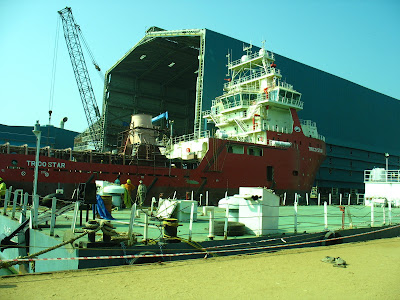
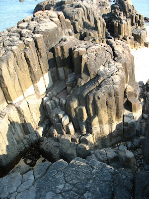
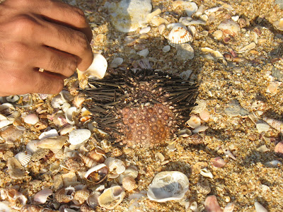
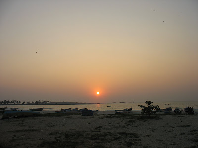

Wednesday saw some of our wingers head to St Mary's Island.  
  
The driver to Udupi was insane, so much so that he stands out even in the insanity that is associated with his race in these parts. He nearly ran over a stupid, deaf cyclist. The latter had an embarrassed smile that seemed to be directed gloatingly at the devil who almost took him away but missed.  
  
The port reeked of fish most foul. One cannot help wondering how an animal that seemingly bathes all its life can smell so bad. Lucky birds. Easy pickings.  
  
The Island is located near a ship building unit. Even as established as the fact gets, the next time I see a ship, only one thing shall be on my mind.  

Man, she's a big one!

The ferry that takes you there plays loud music which incites certain primitive instincts among Dravidians everywhere (Wow, am I racist already?) . The result: Poriki dance, much to the amusement of two foreign tourists. That boat ride was a crash course on that which Bollywood pukes for you to give as wide a berth as possible.  
  
The island itself was very beautiful. Something about water all around us arouses some connection so pure that we hold locations such as clean beaches, islands and river beds very dear. Perhaps the [Aquatic Ape Hypothesis](http://en.wikipedia.org/wiki/Aquatic_ape_hypothesis#The_hypothesis) holds some water after all.  
  
The island is mainly known for hexagonal panels formed naturally on its rocks, like the giant's causeway. These are pretty intriguing.  
  
  

  
Wish we had a better pic of this

  
Red wattled lapwings, a white bellied sea eagle, a bird that looked like a gull billed tern and a frenzied crowd of kites happened. Also saw a sea urchin that had washed ashore.  

Cooool!

  
An hour was decided by the boatman for how long we are to spend there. Wasn't enough. We could only see only half of the island, even at a slightly rushed pace.  
  
The ride back was crowded and kept reminding us that our escape from the crowded mainland was drawing to a close. These dreary reminders manifested in the form of the assortment of people in the boat back, the horrible music and dancing along with the gradually strengthening smell of rotten fish from the shore.  
  
The trip ended with a rather economically priced meal at Udupi. This feature seems to be becoming a norm on my island trips.  
  

  
Customary beautiful pic at the end

  
Photo credits: Srik's cam and whosoever clicked these pics.