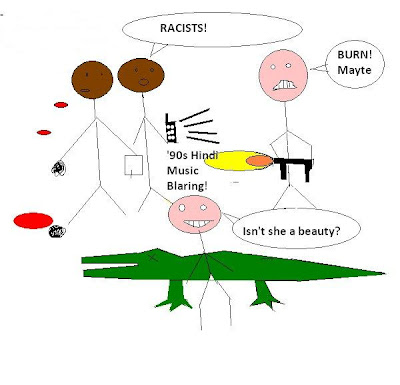

  
  
Well, not just noise in the unwanted sound sense, but anything that would impose your existence unpleasantly on the rest of human kind.  
  
There is no respect for the nose, eyes or the ears in our country. Our cities are eyesores filled with horns, screams and people who play cheap music on mobile phones, the latest being a rather recent affliction. They also reek of every stench in the stench spectrum.  
  
I guess that is why we Indians have such an objectionable reputation outside our country. Here, it's OK to spit out of your window, honk even at traffic signals, puke outside buses, throw anything everywhere and still be part of the majority. Try going to Australia and you get beat up. What's more? You raise an ugly Indian stereotype. The mere sight of an Indian abroad can bring to light these tendencies and invoke hatred enough to want to burn us alive.  
  
Don't take it standing down if someone abuses your sense organs. Demand their right to peaceful existence. Our greatest weakness is Indian chauvinism and complacency. But our greatest strength seems to be screaming foul when our harassed hosts retaliate.