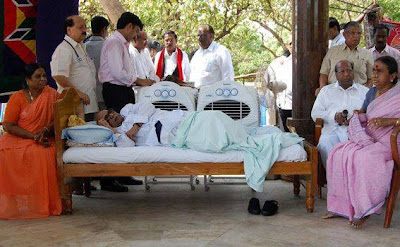

Well, this is a post which is inspired by [Sheki's](http://shekispeaks.wordpress.com/2009/05/24/a-conversation-to-remember/) like [Gullu's](http://vikramgulati88.blogspot.com/2009/06/dont-point-fingers.html). This one is also along the same lines. I have used my comment on the former's blog as a skeleton for the same.  
  

My opinion of Tamilians, while being one myself is one of a somewhat more polarised people. They wanted Tamil declared as the national language merely because it was older. They refuse to treat with dignity, guests to their state. (This is slightly different from the MNS where in Mumbai, so many outsiders have encroached that there is no space for setting a pin on a pin cushion!). All their parties have "Dravida Munnetra Kazhagam" attached to their names, which means parties working for the Dravidian race's upliftment. This itself talks of their regional outlook and lookout.They are also a state known for their regional fanaticism  

Karnataka is fast picking up. However, it is because Kannada today, is facing stiff competition from its own cosmopolitan nature. The Kannada people have been so accommodating of outsiders in the first place that this is the result. I bow down to them for having been so accommodating while acknowledging the rich cultural contributions of Karnataka to the country through the ages. Sadly, there is a Vattal Nagaraj to try and undo all this glory with his charcoal smirching of Kannada faces.  

As for the LTTE, they are an unscrupulous race that bring shame even to the most undignified of Tamil people. However, Tamil politicians, to cash in on the linguistic fanaticism, went to great extents, sympathising with the LTTE. A few insights. 

Vaiko: Tamil Nadu would witness a bloodbath even if the slightest harm befell Liberation Tigers of Tamil Eelam leader V. Prabakaran.

Jayalalithaa: To get a separate Ealem, vote for the AIADMK.

Karunanidhi: Prabhakaran is not a terrorist, but LTTE is a terrorist organisation. (What!!!?)

All this in spite of the group having had the audacity to assassinate our prime minister.  
The latest even went to the extent of an audacious breakfast to lunch “hunger strike".  

We would have been much better if he’d fasted to death or been in times when these idiots were locked up for making statements like this under POTA or any other godforsaken act.

  

Karunanidhi's indefinite fast!  

That is not all. We have Tamilians protesting as far away as England. Guess the recession has left them in the want of some work. I only hope they are put out of their misery soon.

In light of recent news and developments, it is mighty clear that the home ministry in India has secretly funded this war and finally put an end to this atrocious organisation that has been smearing shame on the faces of Tamilians everywhere.