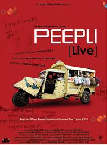

Aamir Khan productions and all, so I went and watched Peepli [live] today.  
  
It was fresh. I've never seen a Hindi movie stick to simplicity as it has. There is only as much sensation for it to just about distinguish itself from what happens in a village everyday. But yes. For the ability to fully appreciate this one, one has to understand the countryside dialect used.  
  
Nevertheless, the essence of the movie is conveyed even to people who know average Hindi.  
  
The movie deals with the struggle that rural India continues to grind through. While trying this edgy theme, the producers have decided to keep the tone light, perhaps to not attract the kind of criticism Adiga's White Tiger or Lapierre's City of Joy have. But that was definitely a compromise. In some places, the humour is a tad misplaced. Where the movie could have scored on emotional points and hit a deep string with the audience, this route was chosen. The background score is sprinkled very appropriately with Indian Ocean tracks.  
  
The ever sensationalising media gets what it deserves: A spanking of a lifetime. The movie also scores from an artistic point of view. It is heartening to see Bollywood finally venturing outside its zone of comfort. Besides, any movie where one hasn't to sit through song and dance sequences is most welcome.