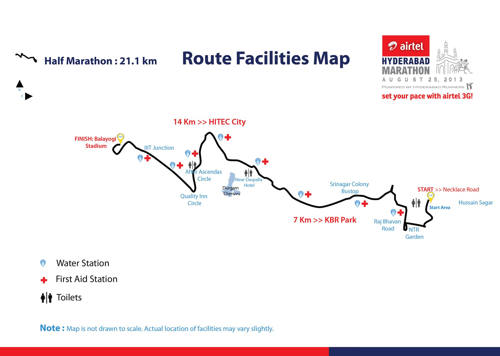
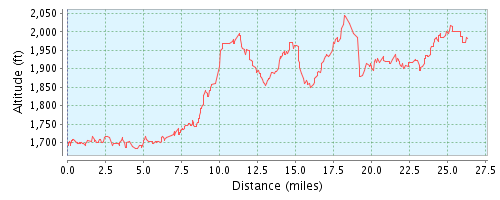
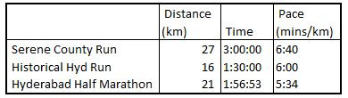

The Hyderabad marathon happened this fine Sunday morning, with overcast skies looking down benevolently on a city whose running culture has taken off splendidly in the last 6 years or so. I had registered for the half marathon and decided to document my experience for posterity just as I have done with the Bangalore 10k runs [here](http://pomusing.blogspot.in/2011/06/world-10k-bangalore.html) and [here](http://pomusing.blogspot.in/2012/06/tcs-10k-bangalore-rerun.html) during my first two editions.  
  
**The Run Up**  
  
Nothing much happened by way of disciplined training for the marathon. In the last couple of years, when I haven't run in a competition, I kept myself fit by doing the occasional 10k workout. Specifically, for the Hyderabad Marathon, only two warm up runs are worth mentioning. The first among these was the L&T Serene County run, where I clocked a little under 3 hours on a 27 K circuit. Having never run more than 12 km, I decided to do this one on a lark. I paced myself rather slowly and conservatively, given the uncertainty and my lack of confidence. Finishing this run strong was a welcome revelation that the 20 Km mark wasn't much of an impediment. The second event was the Historical Hyderabad Run, a great circuit that started at a monument called Taramati Baradari and wound around the foothills of the Golconda Fort before circling back. I timed myself well in the latter half of this run, thanks to a gentleman with a good running watch. I finished the 16K circuit in a little less than 90 minutes, leading me to target the 2 hour mark for the 21 Km half marathon. The icing on the cake with this run was a renowned historian, Anuradha Reddy of INTACH, giving us an enriching walking tour of the Taramati Baradari. This run was organised by [Go Heritage Runs](http://www.goheritagerun.com/), a UNESCO funded initiative that organises runs at historical sites.  
  
Apart from these two events, the only training I underwent was a 5K the day before the half marathon and football/cycling on the weekends to remind my muscles that they could still function.  
  
**The Course**  
**  
**The Hyderabad marathon is touted to be India's toughest city marathon owing to the many undulations that its course meanders to. The course passes through Banjara Hills, a locality that lives up to its name. The half marathon course comprises two flyover climbs with a total ascent of 508 m and a descent of 480 m. Needless to say, this was a course to reckon with, where pacing one's self posed significant challenges. Giving in to the bad habits I have picked up at the day job, here are two visuals to give you a better idea.  
  
  
  

  

  
  
**Race Day**  
  
The half marathon was scheduled to begin at 6 AM, with a request to report 45 minutes in advance. [An unfortunate circumstance](https://www.facebook.com/govind.paliath.7?fref=ts) saw us arrive at the start line at a few minutes past 6 AM. While I was unperturbed that the timing chip would factor in the start time, little did I realise that I would miss the bus if I didn't start on time.  
  
For the uninitiated, pacing buses are seasoned long distance runners who volunteer to finish a particular race in a stipulated time for the benefit of people running around them. Each volunteer carries a flag that specifies his expected finish time, and other runners latch on to them as a means of reference very similar to how [pilot fish latch on to sharks](http://25.media.tumblr.com/tumblr_m7tcbuVcLa1r07kupo1_500.jpg). I had intended on using the 2 hour bus to set my pace for the course, which is a challenge thanks to the terrain of the course.  
  
The run was to start near the Hussain Sagar Lake. I was hopeful of catching breathtaking glimpses of the lake: a sight that was to inspire me to start strong and to be sustained in my mind's eye as I passed through the more mundane innards of Hyderabad. Instead, all I got was to witness the sweaty backs of about a thousand runners who had started ahead of me owing to a better sense of punctuality. As for aquatic scenery, I had to make do with a gutter running alongside the lake, whose stench was determined to fight a winning battle against my pressing need to inhale deeply.  
  
Exit gutter, enter flyovers. The first one was a breeze thanks to the fresh pair of legs and a general sense of enthusiasm. I made sure that I didn't go way below the 6 min/km mark in order to keep my date with the 2 hour mark. I slowly overtook the three 2:30 buses that were milling in the crowded mass of runners in this section. About 3 Km into the circuit, the crowd thinned out to a comfortable stream of rather evenly paced runners. As I overtook the two chatty 2:15 buses, I was privy to their conversation:  
  
"I thought of locking up my family and coming to the run as they threatened to not let me go. The last time around, they didn't let me go and I had to relent because it was raining."  
  
As we moved into more residential areas, we were met with enthusiastic cheering groups all along the way. There was this old couple who had arranged a couple of chairs outside their home in order to click a well coordinated photo with one of their successors, who spared a moment in the midst of his run. There were also budding rockstars lined up on the side of the road in small stalls, playing their stuff on guitars and such. Entirely heartwarming.  
  
On nearing the 8K mark I hit the wonderful equilibrium that every long distance runner knows so well (what I like to term the indefatigable rhythm). There is something about running together that takes one's body to a whole new level of fitness on the race day. The same pace that hurts like hell and causes muscles in the chest to painfully squirm poses no problems. This effect is compounded by finding a running companion with whom one can mutually pace, leading me to acknowledge that in the long run, it's mostly a mind game (Pardon the cheap pun).  
  
I had settled in on a steady cadence. I usually run without my own music in order to save my equanimity from having to meddle with ill fitting earphones.In order to keep my cadence, I have found that playing a song in my head and using my thumping feet to keep rhythm is very effective. This time around, I was aided by Bombay Jayashree's beautiful [OST to The Life of Pi](https://www.youtube.com/watch?v=6fr1trE54oU&ab_channel=AnonymousMotionPictures), whose slow 7 beat rhythm is absolutely delightful. Together, the running companion and I set off to find the 2 hour bus.  
  
Steady progress saw me pass through the workplace, after which the surroundings and landmark assumed a sense of welcome familiarity. However, with this familiarity also came the daunting realisation that the last leg of the marathon would be the toughest, as it was a steady climb of about 5 kilometers, with one god forsaken flyover. Having whizzed past these areas on mostly petrol fueled conveyances, running this stretch was extremely draining. To make matters worse, the sun began to peek out of the clouds and the 2 hour bus was nowhere in sight. The silver lining was that I found a companion for this stretch from Nagpur, who was about 15 years my senior. Nothing inspires one better than these fantastic people.  
  
While the last stretch was hard, my running companions had helped me push on and I was poised to finish on the right side of the two hour mark. The circuit finished at the relatively flat whereabouts of the Gachibowli stadium, and I had finished in a little under 2 hours (1:56:52). I never managed to catch the 2 hour pacer, mostly owing to my delayed start, but I'm guessing that it worked to my advantage.  
  
  
Ironically, I seem most inspired to run after an event like this and not before, when all that training would actually come in handy. I would look to target the 1:45:00 mark, while mulling on whether to run a full marathon this year. I was happy that I had progressed in performance from my two training runs. This would be ensued by the challenge to keep running harder to finish stronger in subsequent events by hopefully sticking to a training schedule.  
  

