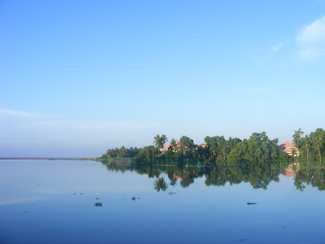
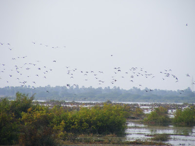
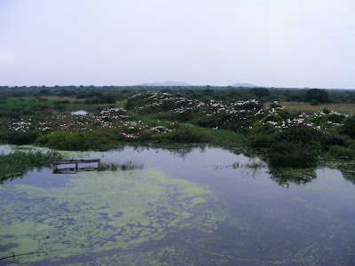

  

I've had a ball. Loads of lifers were put.

  

(L for lifers)  

  

**Veli Lake**

  

Darter, Grey Heron, Purple Heron (L), Black Naped Oriole (Unsure)

  

The darters were everywhere and looked quite majestic drying off their wings in the crucifix position. 

We lived amongst those buildings hiding in the back

  

**Pulicat Lake**

  

Pied Kingfisher, Painted Stork, Lesser Flamingo (L), Paddyfield Pipit, White Browed Bulbul (L), Grey Heron, Brown Headed Gull (L), River Tern, Loten's Sunbird ( Fleeting Glimpse), Spot Billed Pelican

  

Pulicat Lake is a paradise around this time of the year. There are tons of Painted Storks, Flamingos and Spot Billed Pelicans that feed on its waters.

  

The whole lake is one shallow marsh with pockets like this

  

**Nellapattu Bird Sanctuary**

**  
**

Openbill Stork, Spotbilled Pelican, Night Heron (L), Shoveller (L), 

**  
**

Located about 10 km from Pulicat Lake, This place is rather thrown off, but opens a portal into a massive breeding ground for Spot Billed Pelicans, Blackhead Ibis and Openbill Storks. The sheer magnitude and density of this Sanctuary dwarfs anything else I've seen. Thousands of birds come here for the breeding season in the winter. We couldn't spend enough time here to do justice the beauty and the bounty that this place offers.

  

Those are all birds you see

  

It's been a nice month or so.

  

More pics here: [http://www.facebook.com/album.php?aid=26164&id=100001380800740&l=b0576817a7](http://www.facebook.com/album.php?aid=26164&id=100001380800740&l=b0576817a7)

  

Photo Credits: Chinmaya D