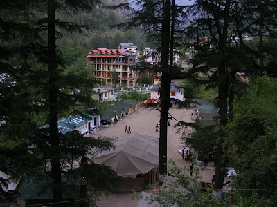
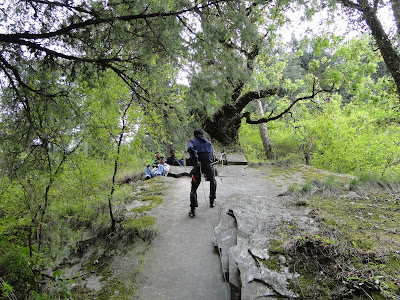
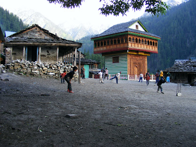
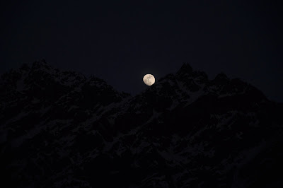
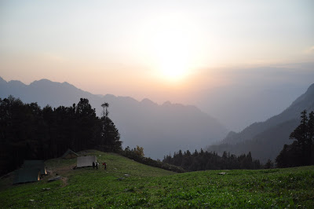

**The Expedition** : Sar Pass, 13,800 Ft (4,200 m) starting from the hippie town of Kasol and coming full circle, organised by the [YHAI](http://www.yhaindia.org/).

  

**The Characters:**  

  

1\. Chinmaya

  

Crazy about photography and can do marvels with his four year old obsolete camera which is on the verge of giving up. But this boy's talent lies in turning anything you say to imply something dirty

  

Codename: Pervy

  

2\. Hannibal

  

Logical genius par excellence. Is also known as the 13th day Adventist given his legendary ability to contradict nature when it beckons to him each morning.

  

Codename: Dopist

  

3\. Anirudh

  

Fun loving dude known for his uncanny abilities to unleash torrents of profanities fiercer than Siberian blizzards when irked. Doesn't bow down to anyone save one character. Frequently chants _Waddup!_ in characteristic falsetto.

  

Codename: Dhadies (Thadis in Palakkad parlance)

  

4\. Supreeth

  

The only dude with the capacity to bring Dadies to his knees. His greatest asset is his ability to establish contacts even in uninhabited reaches of the Atacama desert. At any given time, you'll see him reclined in an [Ananthashayanam](http://www.ariyanair.com/images/Kerala-mural-_-Ananthasayanam001.jpg) pose in the most favourable spot around.

  

Codename: Five star

  

5\. Shankz

  

shankar_cool_s as his id dictates is quite the cool dude and more importantly, the owner of the famed 20X zoom camera. He prefers to swearing in foreign tongues so as to get away with it even in front of unsuspecting mothers and awe-struck children.

  

Codename: Shaitze

  

6\. KoTI

  

Everybody knows who's KoTI. Spelled thus for his unswerving loyalty to TI going as far as to defend Texan IQs. Has the ability to unhinge Dhadies' toxic tongue more often than there are seconds in a minute. Also known for his not having taken offence in 11 years.

  

Codename: Gotakeashower

  

7\. Yours Truly

  

Bird crazy rambler who pissed Dhadies off by deleting some of his pics to make way for birds (of the feathered kind of course). Quite the nature boy considering he never missed his 5:30 body alarms. Doesn't take tips from Hannibal in this regard. 

  

Codename: Pom

  

**Day1: Reporting to Base Camp**

  

The crew reached Kasol, the base camp, on the afternoon of the 11th of May and chilled out for the day. Everybody save Pom was aghast at the sweet Poha that welcomed us there and immediately deemed base camp food uneatable. Other than the field director's doomsday prophesies, the day passed rather uneventfully.

  

The night did not! It started with all of us chewing our nails, sweating and promptly disowning Koti for his nearly profane joke during "culture-time". Only when it ended, cleaner than we'd expected, did we all release nervous squeals of laughter and looked at each other in sheer relief.

  

During the early hours of the 12th, Shankz felt something against his body. Suspecting his tent neighbour Pom, he was surprised until he figured out that the culprit was something little, fuzzy and had proceeded to lick him awake. He then endeavoured to rid the tent of its uninvited canine guest when he was accused of animal cruelty by Koti. On observing its affinity to Chinmaya's chappal, Pom threw one of the pair outside the tent and promptly closed it once the pup charged after it. He then slept well, proud of himself for having outsmarted a creature whose undeveloped brain was the size of a walnut. 

  

**Ze Base Camp**

  

**Day 2: Rock Climbing, Rapelling and the Sneaking out for dinner**

  

Next morning, it dawned upon everyone in the tent that Chinmaya's chappal, which was used to bait the little pup, was missing. The walnut sized had had its revenge!

  

The rude 5:30 AM awakening, done by opening up our tent so that cold shivers shake us awake, was followed by morning exercise. In spite of the gruelling nature of the above mentioned activity, the base camp food did not taste palatable, leading us to discredit the age old saying, "A hungry man has no bad bread" and leading us to append "except at the base camp." It also made us determined to sneak out that night for dinner, the stringent 7 O' clock curfew notwithstanding.

  

The said sneaking out did happen after a session of rock climbing and rappelling. It also helped us give culture-time a well deserved miss and gave us a wonderful dinner in return. Expecting some action on returning, we were pleasantly surprised to figure out that YHAI had given up on reforming us already.

  

**Rappel down**

  

**Day 3: To Grahan Village**

  

53 pairs of legs used to much pampering in mostly urban areas were getting a gruelling reality check as we trudged our way to Grahan village. The bunch of us were quickly ahead of the pack, but kept pushing on under the assumption that some people were ahead of us. Koti fell behind owing to his obsession of clicking every leaf on every tree that we passed by. We reached the next camp way before time to meet a Gujarati uncle and his son, also part of our trek, displaying apprehension with regard to entering the next camp for the fear of scoldings. We cockily brushed his suggestion aside and swaggered in only to the chagrin of a bloodshot eyed uncle who felt very bad that we didn't trek with the rest of the laggards. At a later date, we found out the reason for the bloodshotedness. Hic!

  

Our discovery of Maggi stalls at these altitudes added refreshing variety to the camp food offered. We were also delighted that Maggi was to be our constant companion throughout the trek leading us to blow up more than 1.5 grand on Maggi and tea alone!

  

The discovery of the wisdom in the Arabian way of eating off the same plate saved us a lot of washing duty through the trek, starting from here. We also cherished the Christian custom of drinking off the same cups, leading us to unwittingly launch a secular movement of sorts.

_  
_

__

_**Cricket Grahan style where a sixer = Match Abandoned**_

_  
_

_  
_

_  
_

_Koti's query:_

  

After trekking through barely navigable routes for five hours, we were met with Koti asking us if Grahan village had a bus route. He claimed that his question was justified by the presence of one on [Mt Washington](http://en.wikipedia.org/wiki/Mount_Washington_\(New_Hampshire\)).

  

  

**Day 4: The padhyatra to Padri**

  

The trek to Padri emphasised the term "painfully slow," something that would haunt us for the rest of the trek. We couldn't make it ahead even if we wanted to, owing to our dependency on the guide's knowledge of routes through the forest. 

  

We encountered tilled patches of land fenced off by thorns and fallen trees in the jungle and learnt later that they were actually weed farms. _Waddup!_

  

**La Lune from Padri**

  

  

**Day 5: Rathapani**

  

The trek to Rathapani would've been normal if not for Pom spotting this neat walking stick, all by itself, on a seemingly treacherous slope. Given his tendency to foolishly defy authority, Pom coolly went off the normal path in an attempt to salvage the prized stick. On finding it, he proceeded to chuck it onto the normal path and make his way back. This attempt, however, resulted in it landing short and sliding down further along the slope. Chinmaya claimed that the stick was lost for everybody now. This irked Pom enough to go back further down the slope to recover his prize and slip a few feet in the attempt. This caught the attention of all the trekkers that were making their way to the slope, and for everyone who missed it, Supreeth offered exaggerated running commentary. Pom, already adrenalin pumped, started screaming back at Supreeth to shut his trap in an embarrassing display, which is quite comic in hindsight. 

  

It was not so much for the possession of the stick as it gave Pom an excuse to do something crazy that this act was attempted. The stick was later donated to a fellow trekker looking for one at the camp site.

  

**Camp Rathapani**

  

  

  

Photo credits go to Chinmaya and Dadhies.

  

The [next part](../poMusing/thickForestsThinAirPart2.html) of this post will detail how Sar Pass was passed through and later happenings.