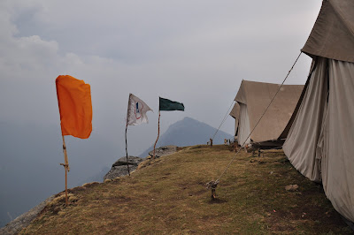
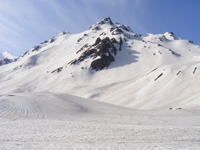
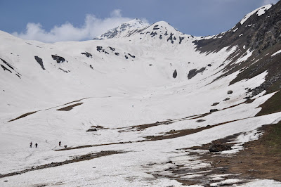
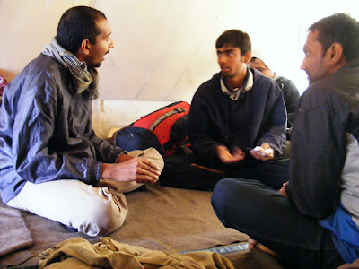
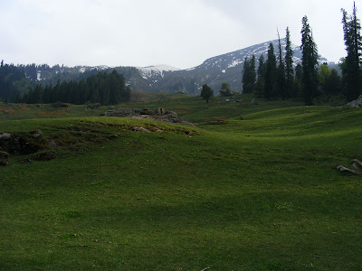

Part 1 can be found [here](../poMusing/thickForestsThinAirPart1.html).

**A Note on Signal Catching:**

  

On the mountains, the golden rule is that the simpler your phone, the more adept it is at "catching" signal. This practice of catching signal is an art in itself. It involves seeking out those specific areas where the mountains have chosen not to get in the way of the transmitting tower. But that is just step one. Once such a spot has been found or shown to you by the locals, you've to hold your phone in the same place without moving an inch, lest you let a mountain disturb this surgical operation. So we found a bunch of people huddled closely near these choice spots trying desperately to catch signal. By the looks of it, a movie on the Zen of Signal Catching might be catching on somewhere.

  

And we also found all the cheap phones winning the battle hands down! All the 1100s were having a field day at the "cost" of the hapless E5s, HTCs and the Galaxies whose owners felt like throwing the overpriced gizmos down the cliff. The soap boxes also had batteries that lasted through the trek while the big guns were all juiced out in one session of signal catching. So on a trek, a 1100 = win!

  

**Day 6: To Nagaru**  

  

The morning exercise on Day 2 was more strenuous than the trek to Nagaru. No sooner than we started, we found ourselves at lunch point, waiting for everyone to gather and kill time till the afternoon was spent, on a precarious ledge with barely enough space to seat our bums. To make matters worse, the lunch point happened to be a signal catching hotspot.

  

On reaching lunch point, we all went through the customary sipping tea slowly and gobbling Maggi fast routine. We then switched to signal catch and tried to let our near and dear know that we're still alive. One man, who'd just said hello and heard the same thing in response before his call was cut, was satisfied that his family at least knew he existed somewhere. We didn't want to ruin it for Mr Silver Lining by pointing out to him that it might as well have been an echo or feedback.

  

Further killing of time was getting harder and we resorted to Hannibal's phone with its mix of music that was fairly well known to all of us. We hit the end of the playlist and had even started playing _Bhaja Govindam._ Finally, gloomy clouds approaching gave us the necessary leverage to egg everyone ahead. We finally inched our way to the Nagaru camp. 

  

Nagaru was supposed to be one hell of a camp. The doomsday prophet at Base Camp had warned us of gales with wind speed hitting the hundreds frequently. The fine weather, however, made it looked benign and as an ideal location for snowball fights. Chinmaya and Pom made the most of their first encounter with snow, much to the annoyance of... you guessed it! Dadhies.

  

**Nagaru Top**

  

**Day 7: Through the top and to Biskerithatch**

  

After a rather sleepless night in the thin mountain air, rattled by hailstorm and sharp winds (both of the natural and the man made kind), we woke up at 3 AM to set off early. We were saved from trekking in pitch darkness thanks to ample moonlight and the ability of ice to reflect this light well enough. We trudged through ice led by Sherpa guides specially summoned up for this day's trek. The rush of adrenalin through our bodies made us forget for a few moments all the niggles and catches that would otherwise have been a big deal. 

  

Just after day break, we reached the summit. The normal routine of how humans do abnormal things when they achieve such feats was played out with people running around in exhilaration. Sadly, routine makes for boring reporting. 

  

After the cold cut short the lives of various overused camera batteries, they were vigourously rubbed between the palms of desperate camera persons to warm them into a few more snaps.

  

**Through Sar Pass**

The next phase of the trek involved sliding down rather steep faces of ice. This was sheer fun except for the part where ice gets into every bit of clothing (I really mean every bit!). The sliding was usually followed by some dance routines enacted to get this ice off your body. Yet, some people silently let the ice melt away inside and chose to preserve their dignity. 

  

**One of them huge slide downs**

After a series of slide downs, we reached lunch point. Hannibal, who'd stolidly endured melting ice inside him, really wanted to get a move on and secured permission for us to go on without having to wait for the rest of the group. On going a little further, it was a little unclear as to what the route was. Pom wanted to desperately get a move on. The others, looking at further sliding action below, were a little more hesitant. Heedless, Pom pushed on. He was followed, much to everyone's surprise, by Supreeth who slid down after. The rest stood back, watching these two go away, making wisecracks at the expense of their hapless fates. 

  

After a while, a 70 year old man from the group who much resembles [Osho](http://www.messagefrommasters.com/Jokes/osho_on_Laughter.jpg) looked at these bunch of youngsters lounging away while waiting for the guide. He then stated, "I don't know about you guys but I'm going on." Thus needled, the young guns kick-started their engines and finally got to camp Biskeri.

  

Biskerithatch might as well carry the sobriquet _The dhobighat of Himachal_ for the display of clothes the trekkers arranged on its lush lawns. Sliding on one's arse down steep slopes of melting snow is a wetting affair indeed!

  

The fiery argument between Hannibal and Pom surely deserves mention here. Its seriousness was such that it would have easily passed off as a glorious debate which was to decide the fate of two races locked in a feud for thousands of years. Both sides brought in a lot of colourful history, debated pros and cons, and gave up ground of their own in pursuit of strategic leverage. This entirely commendable, marvellous exercise was to decide whose version of the card game "bluff" was better, surely a matter that warrants at least this amount of seriousness if not more.

  

**"My bluff is the real deal"**

  

**Day 8: Bandakthatch**

  

Rumoured to be just as much the Switzerland of India as Khajjiar and Dalhousie are, Bandakthatch was a camp sitting on a sprawling lawn replete with breathtaking sights, patrolling Egyptian vultures and mule loads of mule dung. "How better to use this place than play _lagori?",_

suggested the camp leader. When no one bothered about it, he personally went to every tent and goaded people out into the lawn.

  

For the uninitiated, _lagori_ has one team trying to pass a rubber ball and get the other team out by throwing it at them. The only catch in Bandakthatch (rhymes if you say it right) is that you've to dodge the generously laid out manure too or learn to like cutting cakes, as Hannibal refers to the act.

  

As if this wasn't complicated enough, the game, played with several variations across the country, sparked off debates every round it was played. Soup time ended _lagori,_ coming to the rescue of Pom's hapless team which managed to lose every match that was played.

**The lawns of Bandakthatch**

  

_How Koti cried Wolf_

  

Nightfall brought with it pitch darkness and a need for Koti to step out into the woods. After availing of the woods' facilities, he came into the tent, all excited. He claimed he'd seen a fox or a wolf prowling about the lawn at which the dogs were continuously barking. Pom rushed out of the tent in sheer anticipation. On reaching the lawn, he looked eagerly out of the camp, where rumours were spreading faster than the winds atop Nagaru. A few seconds there and he started reasoning that wolves would never make it to that spot and that foxes were too timid to venture into a camp and linger on boldly. We wonder where his incisive reason was when he rushed outside previously. The mystery of the shining eyes in the dark, however, remains unsolved to this day. Skeptics claim it must merely have been a rival dog, but if they are to be believed, the world would be a very boring place without its ghosts, Yetis and Extra Terrestrial abductions. 

  

**Day 9: Back to filthy human surrounds**

  

Every trek, especially the ones which put us in complete isolation of habitations for prolonged periods involve this shock period where we are reunited with the filth that we're actually products of. The whole experience screams "Your vacation is over! Time to get back to you crappy lives, buster!" And no city screams those lines better than the national capital itself. 

  

In our case, the trek ended at a dusty, grimy dam construction site. We then got back to Kasol, spent two days in its forgiving, hippie pace before we made our way to Delhi. Just before parting with the mountains, we happened to try our hand at rafting on the Beas and Parvati that happen to run through their laps. That didn't live up to expectation thanks to the Ulsoor Lake like odour that emanated from the rivers. The expert in our boat didn't help our cause either, taking us through particularly tame parts of the river and avoiding many an exciting rapid while constantly reminding us of how much he hated Indians. 

  

All in all, it was this tremendous experience that offered enjoyment, thrill and goodness in Himalayan proportions.