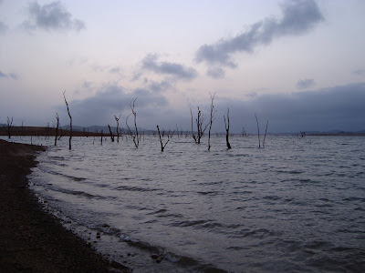
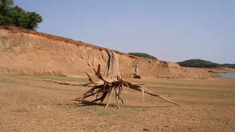
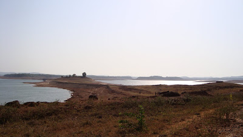

Around 2 months ago, I had been on a trek to the Sharavathi valley with a few friends residing in to my Bangalore whereabouts. This is a post to capture the precious residue of what I have failed to note down all these days.  
  
The said trip happened by bus from here. It reached a place called Sagara early in the morning (around 7 or so). Thanks to my friend Karthik who had already been to Sagara, we had no problem finding a good guide or a decent place to freshen up. This was at a public toilet which was faraway from to public eye to the extent to which it could comfortably squash its stereotype.  
  
We then proceeded to a catchment area of a dam built in times bygone. This place was called Linganamakki. The dam was reportedly built by Vishweshwaraya during British times. However, it is no longer operational, leaving only a landscape which has been rendered so far off from its natural shape that it appears surreal.  
  

The ominous deluge  

  
We trekked for about an hour to reach the catchment area. It was like nothing I've seen before. It wasn't the most beautiful place I've seen; but if I had to choose unearthly too, this was it. Sadly though, it wasn't too full of life save the small fish in the water. The absence of even mollusks in the crystal clear, fresh water was conspicuous; not to mention the bird life and the insect life. We had to reach an island quite faraway (a little more than a kilometer or so) to setup camp. Our guide had arranged for tents, supplies and a cook that we were to need for the overnight stay there.  
  
  

The grand jeté plus writhing tentacles!  

  
  
While most of the lot decided to use coracles for the crossing, a few of us decided to swim the distance. Life jackets were necessary for both the enduring task as well as to stick by regulations. Nevertheless, it was a memorable swim for it was quite long and not the easiest thing to achieve (especially for one of us who hadn't swum an inch before!). The evening saw us all take to the watery abode that now surrounded us. Even people who couldn't swim otherwise could manage to with those hefty jackets around them.  
  
The island was something like a plateau, which was crowned with lush green vegetation. I guess these are the parts of the valley that were spared and managed to retain their greenery. The water that surrounded us were filled with dead trees rising above the watery surface; the unexpected deluge having done them in more than a century ago. On a moon lit night, I can envision this to be the unanimous birthplace of eerie tree spirits and powerful swamp monsters; not those disgusting ones that are plantlike, but the kind that can get their job done.  
  

Nevertheless, beautiful  

  
The next morning saw us head out into the water yet again. Here is where I learnt a valuable lesson or two in coracle rowing and control. These were tar patched wooden frameworks. Earlier, I managed to get branded irreversibly right where I rested my butt on one of them unwittingly. On our return, we left late that morning to cross the island from a passage through the now abandoned dam. This was a trek of around 4-5 hours with a break in the middle for lunch. It was made mostly trudging through a leafy, shady thoroughfare through the jungle where we spotted a huge brown stick insect. We then proceeded to reach the dam where innumerable river terns were doing the rounds right above our heads. On realising that the dam-route was closed, we had to detour to a few more hours of trekking through forested landscape to reach a road which took us back to Sagara. Nothing noteworthy was spotted save these critters and a flock of cormorants.  
  
This was followed by a very economically priced meal at Sagara and a return home from an unforgettable trip.