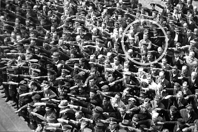

How was an abomination like Hitler allowed to walk the face of the earth, with one of the most powerful countries of Europe at his bidding?  
  
How did a party without a majority come to wield so much power? How were Hitler's orders executed in broad daylight, with the endorsement of an educated, conscientious society? How was the transfer of power, authority and the subservience of an entire nation nearly complete in a matter of weeks?  
  
There is more to that than meets the eye, and I am only beginning to scratch the surface.   
  
A quick breakdown of events as they transpired in the year of 1933. The Nazi party was a minority and did not have a majority vote from the previous elections. In February, a fire broke out in the Reichstag - the German parliament building. The Nazis used this as an opportunity to claim that Germany was facing a communist revolution, but that was merely a trigger for a multitude of political actions and alliances that had happened in the background. The bottom line - Hitler was made the chancellor and granted dictatorial power in March 1933 - the power to issue the most ruthless orders without legal objection.  
  
The manner in which the Nazis moved subsequently is revealing. Within two months after March 1933, the national police was taken over, and people at the leading posts were replaced by Nazi officials. The SS was instituted in Bavaria under the leadership of Heinrich Himmler. This period saw the disappearance of extant politicians overnight - any politicians that the Nazis thought would not support their agenda. These politicians were "neutralized". It also saw widespread burning of books across German universities in huge bonfires in the open.   
  
"Where they burn books, they will also ultimately burn people" - Heinrich Heine, Jewish German playwright, ca. 1820-21.  
  
Just to reiterate, all this happened in a period of two months. Imagine going off on a long vacation, only to return to your country and not recognize it.  
  
This begs the question - how did the people allow for this to happen? How was there widespread support for the Nazis through all these events? The answer lies in the will of a handful of individuals that were driven by an evil agenda, handpicked for the ruthless manner in which they could further it. A handful of individuals that Adolf Hitler knew intimately well - the likes of Heinrich Himmler, Herman Göring and Joseph Goebbels.  
  
Over the years that succeeding the quick rise of the Nazi party, the whole nation was turned systematically into Nazi sympathizers. People who aligned with the Nazis were rewarded. More importantly,anybody who did not was brutally punished. Families would disappear on mere suspicion. The system rewarded informers, and especially if the victims were Jewish.  
  
This photograph from 1936 is iconic. It shows one man standing with his arms crossed as Hitler passed through a public rally. That man is August Landmesser, a German who fell in love with a Jewish woman. He was sentenced to two years in a labour camp, and his would be bride was sent to a death camp. Today, we remember August Landmesser. We remember him because what he did - not saluting - took so much courage, and that should never be forgotten.   
  
  

  
  
We must understand that resistance was completely futile. Anybody who opposed the party disappeared. Their lives, and the lives of their loved ones were taken, and there was no trace of martyrdom - one does not turn into a martyr by vanishing. How pointless does it seem to stake one's entire life to making a statement, only to disappear and end up forgotten?  
  
In effect, the German nation - the Volk (the masses), the Wehrmacht (the army) and everybody it contained were turned into pawns. Pawns of a regime of evil men who propagated this evil and brutally punished anyone who could even be suspected of opposing them. Dan Carlin, in his excellent podcast Hardcore History, remarks about the people who rose with Hitler and thrived in his autocratic regime. Ones who could sit in their luxurious Berlin villas and send armies of young Germans to fight in the the Russian plains in winter, to die a painful, pointless death in the name of patriotism. Who could field boys as young as 12 to defend Berlin on its last legs when they hid in their bunkers or sought to escape to Argentina. Who could perpetrate unspeakable atrocities on the psyche of an entire nation. Dan mentions how these Nazi leaders would be out of jobs in a democracy.   
  
The example of Hitler and the Nazi party isn't one to to be taken in isolation. It is arguably the best documented failing of human civilization, but it is sure as hell not the only failing. The reason it is documented and spoken about in such elaborate tones is so that we know what can happen to civilized, educated, conscientious societies, if we are not guarded. It is documented so that we can never forget.  
  
While the Nazi regime in Germany was an extreme example, we are surrounded even today by systemic corruption in society, where honest public officials are tormented until they either capitulate to the corrupt system or resign. The degree of corruption may vary, but the manner in which it propagates is similar - top down, and corrupt leaders carefully selecting like-minded and often ruthless aides. This corruption trickles all the way down to the common man, who is merely a pawn in this grand scheme. The poorer and more desperate the pawns, the more unlikely they are to disturb the order that exploits them. This corrupt order toils hard to sustain the status quo, and until its viscous propagation is broken, there is no hope for alleviating some of humanity's worst suffering in this day and age.   
  
Inspiration / Sources:  
1\. [The Ghost of the Ost front series ](http://www.dancarlin.com/product/hardcore-history-ghosts-ostfront-series/)\- Harcore History by Dan Carlin  
2\. [Topology des Terror ](https://www.topographie.de/en/) Museum in Berlin  
3\. [The man who did not salute Hitler](https://www.theodysseyonline.com/the-man-who-did-not-salute)